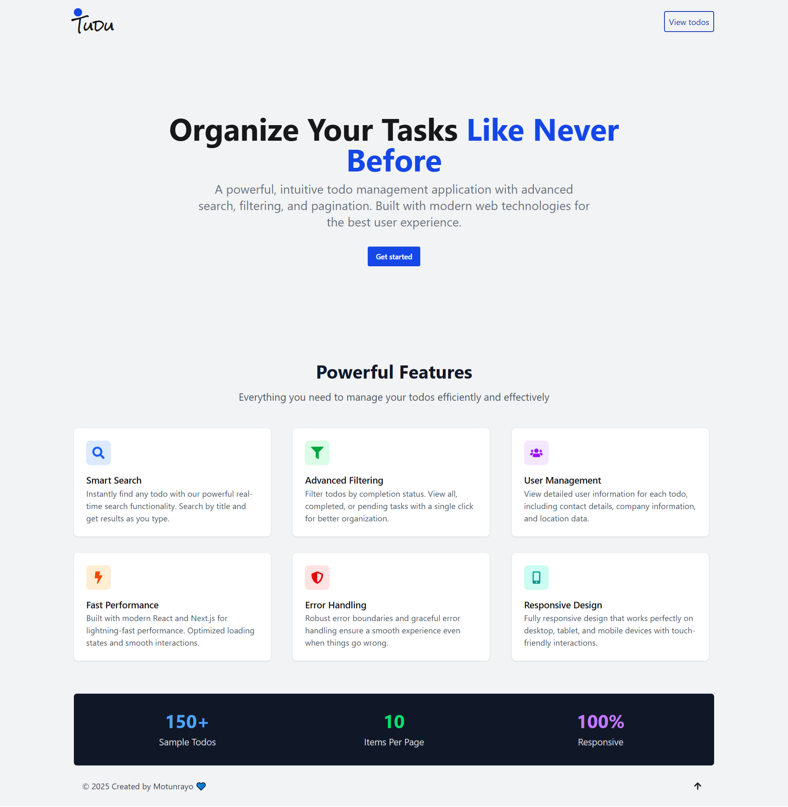
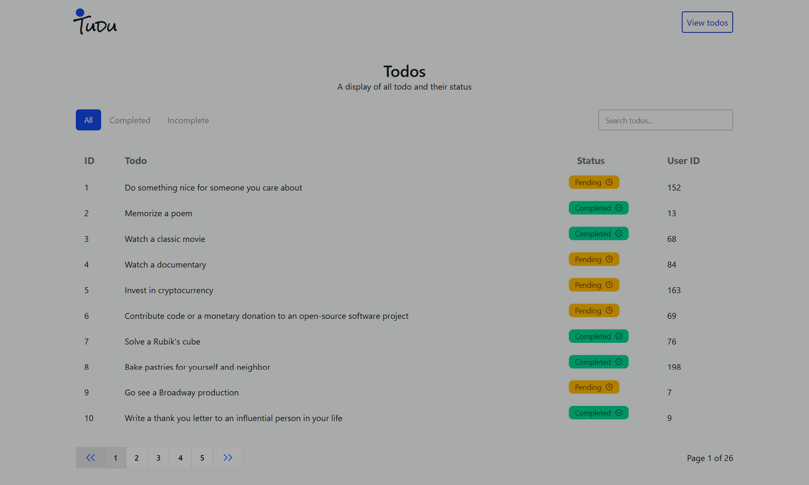
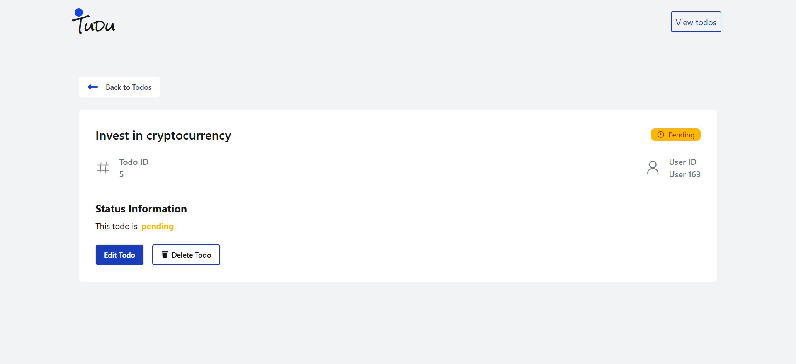

# Tudu

Tudu is a full-featured Todo application built using Reactjs, Tanstack query and Tanstack Router. This project is designed to showcase modern frontend engineering skills, including best practices with React, Api integration, client side routing, pagination, accessibilty and responsive uder interface.


Live demo: Vercel [Tudu](https://tudu-lake.vercel.app)

---

## Features

- Fetch and display todos from ([DummyJSON](<https://dummyjson.com/todos)>))
- Client -side pagination which included 10 todo items per page
- Dispaly of Individual todo details such as todo title, status and userID
- Searching a list of todo with its title
- Filtering by completion status (All/ Complete / Incomplete)
- Nested Routing for todo detail view
- Acessible and responsive UI

---

## Installation & Setup Instruction

1. **Clone the repository**

   ```bash
   git clone https://github.com/motuncoded/Tudu.git
   cd Tudu
   ```

2. **Install dependencies**

   ```bash
   npm install
   # or
   yarn install
   ```

3. **Start the development server**

   ```bash
   npm run dev
   # or
   yarn dev
   ```

4. **Build for production**
   ```bash
   npm run build
   # or
   yarn build
   ```

---

## Available scripts and commands

| Command                   | Description                      |
| ------------------------- | -------------------------------- |
| `dev : vite`              | Start the development server     |
| `build : vite build`      | Build the project for production |
| `lint : eslint .`         | Run ESLint for code quality      |
| `preview : vite preview ` | Preview the production build     |

## Technology Stack & Architecture

- **React**: Core UI library (v19.x)
- **Vite**: Fast build tool and dev server
- **React Tanstack Router**: Client-side routing
- **TailwindCSS**: Utility-first CSS framework
- **ESLint**: Linting and code quality
- **DaisyUI**: Prebuilt TailwindCSS components
- **React Icons**: Set of icons
- **React Tanstack Query**: handles the API

**Architecture Decisions**:

- Modular component structure for maintainability
- API-calling logic separated from UI components
- Uses React Router for nested routes (e.g., `/todos/:id` for details and `/todos` for list of todos)
- TailwindCSS for rapid and consistent design
- Daily UI with faster design template
- Icons served by react icons

## API Documentation & Usage

### Fetch Todos

- **Endpoint**: `GET https://dummyjson.com/todos`
- **Pagination**: 10 items per page using query params
- **Todo Object**:
  ```json
  {
    "id": 1,
    "todo": "Do the laundry",
    "completed": false,
    "userId": 5
  }
  ```

### Example Usage

- Fetch api calls using custom hooks

```js
fetch("https://dummyjson.com/todos?limit=10&skip=0")
  .then((res) => res.json())
  .then((data) => setTodos(data.todos));
```

- Filters and pagination are handled on the client side.

```js
fetch("https://dummyjson.com/todos?limit=150")
  .then((res) => res.json())
  .then((data) => setTodos(data.todos));
```

- Clicking on a todo navigates to `/todos/:id` to show detailed info.

```js
fetch("https://dummyjson.com/todos/${id}")
  .then((res) => res.json())
  .then((data) => setTodos(data.todos));
```

---

## Screenshots

_Replace these with actual screenshots or GIFs as desired._






---

## Known issues or limitations

- Inability to update and delete DummyJson API

## Future improvements planned

- User Authetication
- User Authorisation to delete and update todo
- Real time API fetching of data from Backend and not dummy API
